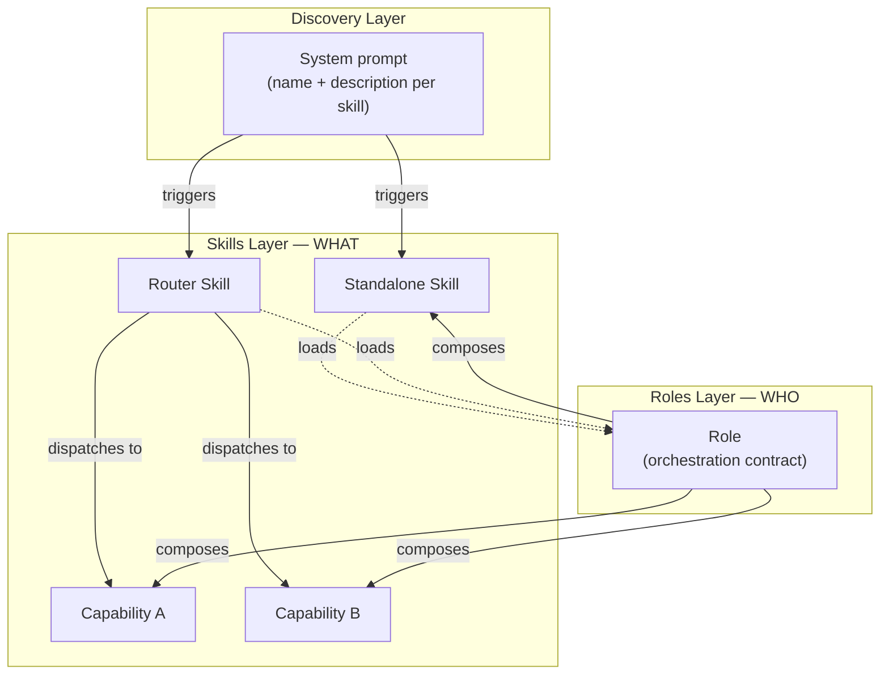

# Skill System Foundry


Meta-skill for building AI-agnostic skill systems with a two-layer architecture of skills and roles, templates, validation tools, and cross-platform authoring guidance based on the [Agent Skills specification](https://agentskills.io).

## What a Skill Looks Like

A skill is a Markdown file with YAML frontmatter. Here's a minimal standalone skill:

````markdown
---
name: deploy-helper
description: >
  Manages deployment workflows — runs pre-deploy checks, executes deployments
  to staging and production, and handles rollbacks. Activates when the user
  mentions deploying, releasing, or rolling back.
---

# Deploy Helper

Run deployment workflows for staging and production environments.

## Pre-Deploy Checks

Before deploying, verify:
1. All tests pass: `npm test`
2. No uncommitted changes: `git status`
3. Branch is up to date: `git pull --dry-run`

## Deploy

```bash
./scripts/deploy.sh <environment>
```
````

That's it — a `SKILL.md` file with a name, a description, and instructions. AI tools discover it, inject its metadata into the system prompt, and load its full content when triggered.

When a domain grows beyond what one file can handle, a **router skill** dispatches to **capabilities** — self-contained sub-skills loaded on demand. Adding capabilities to a router doesn't increase its discovery cost — only adding new registered skills does.

## Architecture



- **Skills** define *what* to do — canonical, AI-agnostic knowledge. Standalone for focused tasks, router for complex domains. A skill can load one or more **roles** for interactive workflow logic.
- **Roles** define *who* orchestrates — composing multiple skills/capabilities into workflows with responsibility, authority, and constraints. Roles never reference other roles; when orchestration spans multiple roles, a coordination skill sequences them.
- **Dependencies flow downward in composition** — roles compose skills and capabilities; capabilities never know they are being orchestrated. The only upward references are orchestration skills that load roles by contract.

For the full architecture (orchestration paths, dependency rules, manifest), see the [Architecture wiki page](https://github.com/milanhorvatovic/skill-system-foundry/wiki/Architecture).

## Installation

### npx skills

```bash
npx skills add milanhorvatovic/skill-system-foundry
```

Installs the skill to Claude Code, Codex, Cursor, Gemini CLI, Windsurf, Kiro, GitHub Copilot, Cline, OpenCode, and many more agents. See [skills.sh](https://skills.sh) for the full list of supported agents.

### Claude Code Plugin

```
/plugin marketplace add milanhorvatovic/skill-system-foundry
/plugin install skill-system-foundry@skill-system-foundry
```

### Gemini CLI

```bash
gemini skills link milanhorvatovic/skill-system-foundry
```

### Manual

Copy the `skill-system-foundry/` directory into your project's `.agents/skills/` path:

```bash
cp -r skill-system-foundry /path/to/project/.agents/skills/
```

### GitHub Releases

Download the latest versioned zip from [Releases](https://github.com/milanhorvatovic/skill-system-foundry/releases) and extract into your skills directory. See [CHANGELOG.md](CHANGELOG.md) for what changed between versions.

Each release also publishes a `skill-system-foundry-vX.Y.Z.zip.sha256` checksum file. The filename column inside that file is basename-only, so download both files into the same directory, `cd` into it, and then run the command for your platform:

```bash
# Linux
cd /path/to/downloads && sha256sum --check skill-system-foundry-vX.Y.Z.zip.sha256

# macOS
cd /path/to/downloads && shasum -a 256 -c skill-system-foundry-vX.Y.Z.zip.sha256
```

```powershell
# Windows (PowerShell) — run from the directory containing both files
$expected = ((Get-Content skill-system-foundry-vX.Y.Z.zip.sha256 -Raw).Trim() -split '\s+' | Select-Object -First 1).ToLower()
$actual   = (Get-FileHash skill-system-foundry-vX.Y.Z.zip -Algorithm SHA256).Hash.ToLower()
if ($expected -eq $actual) { "OK" } else { "MISMATCH"; exit 1 }
```

On Linux and macOS the expected output is `skill-system-foundry-vX.Y.Z.zip: OK`.

## Getting Started

**Prerequisites:** Python 3.12+ and a local checkout of this repository (the scripts run from `skill-system-foundry/`).

1. **Create your first skill** — Use the scaffolding tool to generate a new skill from a template:
   ```bash
   cd skill-system-foundry
   python scripts/scaffold.py skill my-skill --root /path/to/project/.agents
   ```
   Expected output:
   ```
     Created: /path/to/project/.agents/skills/my-skill/SKILL.md

   ✓ Skill 'my-skill' scaffolded at /path/to/project/.agents/skills/my-skill
     Next: edit /path/to/project/.agents/skills/my-skill/SKILL.md and update manifest.yaml
   ```

   Optional directories (`references/`, `scripts/`, `assets/`) are not created by default. Add them when needed with `--with-references`, `--with-scripts`, or `--with-assets`.

2. **Validate your work** — Run validation to ensure spec compliance:
   ```bash
   python scripts/validate_skill.py /path/to/project/.agents/skills/my-skill
   ```
   Expected output:
   ```
   Validating: /path/to/project/.agents/skills/my-skill
   Type: registered skill
   ------------------------------------------------------------
   ✓ All checks passed
   ```

3. **Deploy to tools** — Tools that scan `.agents/skills/` natively (Codex, Gemini CLI, Warp, OpenCode, Windsurf) need nothing else. For other tools, create thin deployment pointers. See the [Project Integration wiki page](https://github.com/milanhorvatovic/skill-system-foundry/wiki/Project-Integration) for details.

4. **Bundle for distribution** (optional) — Package a skill as a self-contained zip for Claude.ai upload, Gemini CLI, or offline sharing:
   ```bash
   python scripts/bundle.py /path/to/project/.agents/skills/my-skill \
     --system-root /path/to/project/.agents --output my-skill.zip
   ```

## Releases

Shipped versions and what changed between them are tracked in [CHANGELOG.md](CHANGELOG.md). Each release is also published as a versioned zip on the [Releases](https://github.com/milanhorvatovic/skill-system-foundry/releases) page (with a SHA256 checksum file alongside it; see the [GitHub Releases](#github-releases) installation section for verification commands).

Maintainer release flow at a glance: dispatch the `Release prep` workflow with the new version → review and merge the auto-opened release PR → run `gh release create vX.Y.Z --generate-notes`. The post-merge `release.yml` workflow then bundles the zip and publishes the assets. Detailed steps live in the `git-release` skill under `.agents/skills/git-release/SKILL.md`.

## Repository Structure

```
.
├── LICENSE                      ← MIT license
├── README.md                    ← this file (repository overview)
└── skill-system-foundry/         ← the meta-skill itself
    ├── README.md                ← skill-level documentation
    ├── SKILL.md                 ← router entry point (Agent Skills specification)
    ├── references/              ← guidance loaded into context
    ├── assets/                  ← templates for scaffolding components
    └── scripts/                 ← validation, scaffolding, and bundling tools
```

See [skill-system-foundry/README.md](skill-system-foundry/README.md) for the skill's capabilities, file layout, and usage instructions.

## Windows Setup

Claude Code support relies on symlinks (`CLAUDE.md` and `.claude/skills/`). On Windows 11, two one-time steps are recommended (ideally before cloning) to make symlinks work reliably:

1. Enable **Developer Mode** in Windows so non-admin processes can create symlinks. See [Microsoft's docs](https://learn.microsoft.com/windows/apps/get-started/enable-your-device-for-development) for current instructions.
2. Enable symlink support in git — either once globally, for a single clone, or per repository:
   ```bash
   # One-shot when cloning (preferred for new clones)
   git clone -c core.symlinks=true <repo-url>

   # Global (applies to all repositories you clone later)
   git config --global core.symlinks true

   # Per repository (run inside an existing cloned directory)
   git config core.symlinks true
   # Then refresh the working tree so Git re-creates symlinks
   # WARNING: this discards local changes to tracked files; stash or commit first
   git restore -- .
   ```

For repositories cloned after enabling symlink support (via `-c core.symlinks=true` or global config), symlinks work transparently on clone and checkout. If you cloned before enabling symlinks, either re-clone with `git clone -c core.symlinks=true <repo-url>` or set `core.symlinks=true` and re-checkout the working tree as shown above.

To confirm that symlinks were materialized correctly (and not replaced by plain files):

- Run `git ls-files -s CLAUDE.md` and check that the mode is `120000` (indicating a symlink).
- On Unix-like systems, run `ls -l CLAUDE.md` or `readlink CLAUDE.md` to see the link target.
- On Windows:
  - In Command Prompt (`cmd.exe`), run `dir CLAUDE.md` and ensure it is listed as a `<SYMLINK>` entry.
  - In PowerShell, run `Get-Item CLAUDE.md | Format-List Mode,LinkType,Target` and check that `LinkType` is `SymbolicLink`.

## Learn More

| Topic | Link |
|-------|------|
| Release history | [CHANGELOG.md](CHANGELOG.md) |
| Full architecture and orchestration paths | [Architecture](https://github.com/milanhorvatovic/skill-system-foundry/wiki/Architecture) |
| Token economy, conciseness, degrees of freedom | [Design Principles](https://github.com/milanhorvatovic/skill-system-foundry/wiki/Design-Principles) |
| Tool landscape and discovery paths | [Supported Tools](https://github.com/milanhorvatovic/skill-system-foundry/wiki/Supported-Tools) |
| Recommended layout and deployment pointers | [Project Integration](https://github.com/milanhorvatovic/skill-system-foundry/wiki/Project-Integration) |
| Key terms defined | [Glossary](https://github.com/milanhorvatovic/skill-system-foundry/wiki/Glossary) |
| Guided examples | [Walkthroughs](https://github.com/milanhorvatovic/skill-system-foundry/wiki/Walkthroughs) |

### Further Reading

**Official tool documentation:** [Claude Code](https://code.claude.com/docs/en/skills) · [Codex](https://developers.openai.com/codex/skills/) · [Gemini CLI](https://geminicli.com/docs/cli/skills/) · [Cursor](https://cursor.com/docs/context/skills) · [Windsurf](https://docs.windsurf.com/windsurf/cascade/skills) · [Kiro](https://kiro.dev/docs/cli/skills/)

**Authoring guides:** [Anthropic](https://github.com/anthropics/skills/blob/main/skills/skill-creator/SKILL.md) · [OpenAI](https://github.com/openai/skills/blob/main/skills/.system/skill-creator/SKILL.md) · [Google](https://github.com/google-gemini/gemini-cli/blob/main/packages/core/src/skills/builtin/skill-creator/SKILL.md)

**Standards:** [Agent Skills specification](https://agentskills.io) · [AGENTS.md convention](https://agents.md/) · [ROLES.md convention](https://www.roles.md)
