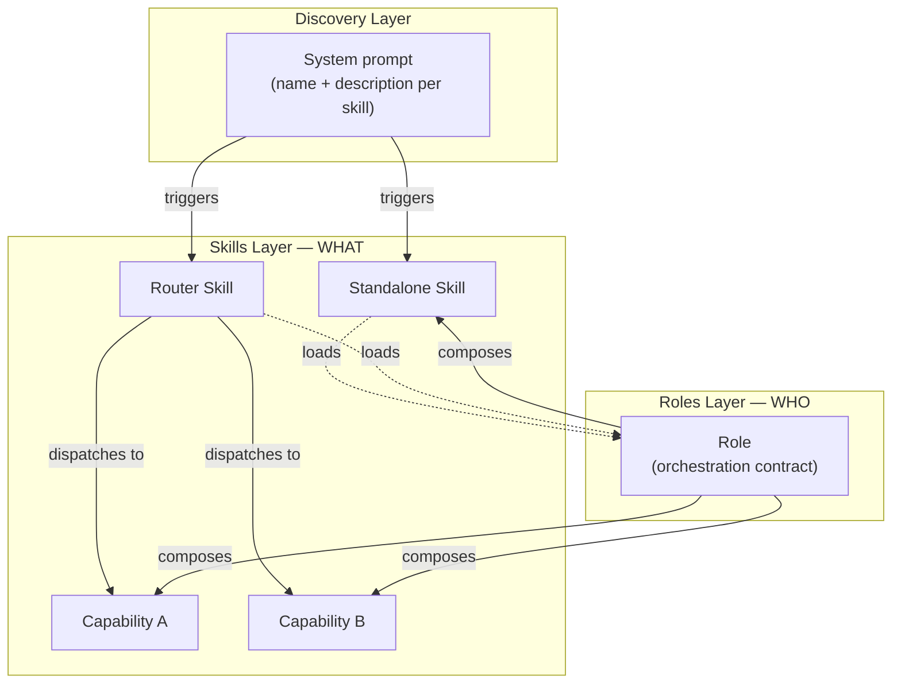

# Skill System Foundry

Meta-skill for building AI-agnostic skill systems with a two-layer architecture of skills and roles, templates, validation tools, and cross-platform authoring guidance based on the [Agent Skills specification](https://agentskills.io).

## What a Skill Looks Like

A skill is a markdown file with YAML frontmatter. Here's a minimal standalone skill:

````markdown
---
name: deploy-helper
description: >
  Manages deployment workflows — runs pre-deploy checks, executes deployments
  to staging and production, and handles rollbacks. Activates when the user
  mentions deploying, releasing, or rolling back.
---

# Deploy Helper

Run deployment workflows for staging and production environments.

## Pre-Deploy Checks

Before deploying, verify:
1. All tests pass: `npm test`
2. No uncommitted changes: `git status`
3. Branch is up to date: `git pull --dry-run`

## Deploy

```bash
./scripts/deploy.sh <environment>
```
````

That's it — a `SKILL.md` file with a name, a description, and instructions. AI tools discover it, inject its metadata into the system prompt, and load its full content when triggered.

When a domain grows beyond what one file can handle, a **router skill** dispatches to **capabilities** — self-contained sub-skills loaded on demand. The system scales from one skill to hundreds while keeping discovery cost constant.

## Architecture



- **Skills** define *what* to do — canonical, AI-agnostic knowledge. Standalone for focused tasks, router for complex domains. A skill can load one or more **roles** for interactive workflow logic.
- **Roles** define *who* orchestrates — composing multiple skills/capabilities into workflows with responsibility, authority, and constraints. Roles never reference other roles; when orchestration spans multiple roles, a coordination skill sequences them.
- **Dependencies flow downward** — a capability never knows it's being orchestrated; changes propagate predictably.

For the full architecture (orchestration paths, dependency rules, manifest), see the [Architecture wiki page](https://github.com/milanhorvatovic/skill-system-foundry/wiki/Architecture).

## Installation

### npx skills

```bash
npx skills add milanhorvatovic/skill-system-foundry
```

Installs the skill to Claude Code, Codex, Cursor, Gemini CLI, Windsurf, Kiro, GitHub Copilot, Cline, OpenCode, and many more agents. See [skills.sh](https://skills.sh) for the full list of supported agents.

### Claude Code Plugin

```
/plugin marketplace add milanhorvatovic/skill-system-foundry
/plugin install skill-system-foundry@skill-system-foundry
```

### Gemini CLI

```bash
gemini skills link milanhorvatovic/skill-system-foundry
```

### Manual

Copy the `skill-system-foundry/` directory into your project's `.agents/skills/` path:

```bash
cp -r skill-system-foundry /path/to/project/.agents/skills/
```

### GitHub Releases

Download the latest versioned zip from [Releases](https://github.com/milanhorvatovic/skill-system-foundry/releases) and extract into your skills directory.

## Getting Started

1. **Create your first skill** — Use the scaffolding tool to generate a new skill from a template:
   ```bash
   cd skill-system-foundry
   python scripts/scaffold.py skill my-skill --root /path/to/project/.agents
   ```
   Expected output:
   ```
   Created skill at /path/to/project/.agents/skills/my-skill/
     /path/to/project/.agents/skills/my-skill/SKILL.md
   ```

2. **Validate your work** — Run validation to ensure spec compliance:
   ```bash
   python scripts/validate_skill.py /path/to/project/.agents/skills/my-skill
   ```
   Expected output:
   ```
   Validating: /path/to/project/.agents/skills/my-skill
     ✓ SKILL.md exists
     ✓ Frontmatter valid
     ✓ Name matches directory
     ✓ Body within line limit

   Result: PASS
   ```

3. **Deploy to tools** — Tools that scan `.agents/skills/` natively (Codex, Gemini CLI, Warp, OpenCode, Windsurf) need nothing else. For other tools, create thin deployment pointers. See the [Project Integration wiki page](https://github.com/milanhorvatovic/skill-system-foundry/wiki/Project-Integration) for details.

4. **Bundle for distribution** (optional) — Package a skill as a self-contained zip for Claude.ai upload, Gemini CLI, or offline sharing:
   ```bash
   python scripts/bundle.py .agents/skills/my-skill --system-root .agents --output my-skill.zip
   ```

## Repository Structure

```
.
├── LICENSE                      ← MIT license
├── README.md                    ← this file (repository overview)
└── skill-system-foundry/         ← the meta-skill itself
    ├── README.md                ← skill-level documentation
    ├── SKILL.md                 ← router entry point (Agent Skills specification)
    ├── references/              ← guidance loaded into context
    ├── assets/                  ← templates for scaffolding components
    └── scripts/                 ← validation, scaffolding, and bundling tools
```

See [skill-system-foundry/README.md](skill-system-foundry/README.md) for the skill's capabilities, file layout, and usage instructions.

## Learn More

| Topic | Link |
|-------|------|
| Full architecture and orchestration paths | [Architecture](https://github.com/milanhorvatovic/skill-system-foundry/wiki/Architecture) |
| Token economy, conciseness, degrees of freedom | [Design Principles](https://github.com/milanhorvatovic/skill-system-foundry/wiki/Design-Principles) |
| Tool landscape and discovery paths | [Supported Tools](https://github.com/milanhorvatovic/skill-system-foundry/wiki/Supported-Tools) |
| Recommended layout and deployment pointers | [Project Integration](https://github.com/milanhorvatovic/skill-system-foundry/wiki/Project-Integration) |
| Key terms defined | [Glossary](https://github.com/milanhorvatovic/skill-system-foundry/wiki/Glossary) |
| Guided examples | [Walkthroughs](https://github.com/milanhorvatovic/skill-system-foundry/wiki/Walkthroughs) |

### Further Reading

**Official tool documentation:** [Claude Code](https://code.claude.com/docs/en/skills) · [Codex](https://developers.openai.com/codex/skills/) · [Gemini CLI](https://geminicli.com/docs/cli/skills/) · [Cursor](https://cursor.com/docs/context/skills) · [Windsurf](https://docs.windsurf.com/windsurf/cascade/skills) · [Kiro](https://kiro.dev/docs/cli/skills/)

**Authoring guides:** [Anthropic](https://github.com/anthropics/skills/blob/main/skills/skill-creator/SKILL.md) · [OpenAI](https://github.com/openai/skills/blob/main/skills/.system/skill-creator/SKILL.md) · [Google](https://github.com/google-gemini/gemini-cli/blob/main/packages/core/src/skills/builtin/skill-creator/SKILL.md)

**Standards:** [Agent Skills specification](https://agentskills.io) · [AGENTS.md convention](https://agents.md/) · [ROLES.md convention](https://www.roles.md)
